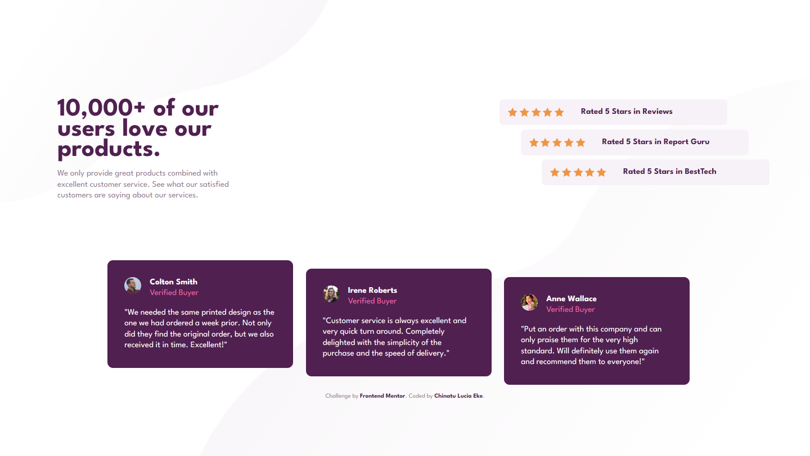

# Frontend Mentor - Social proof section solution

This is a solution to the [Social proof section challenge on Frontend Mentor](https://www.frontendmentor.io/challenges/social-proof-section-6e0qTv_bA). Frontend Mentor challenges help you improve your coding skills by building realistic projects.

## Table of contents

-   [Overview](#overview)
    -   [The challenge](#the-challenge)
    -   [Screenshot](#screenshot)
-   [My process](#my-process)
    -   [Built with](#built-with)
    -   [What I learned](#what-i-learned)
    -   [Useful resources](#useful-resources)
-   [Author](#author)

## Overview

### The challenge

Users should be able to:

-   View the optimal layout for the section depending on their device's screen size

### Screenshot

## My process

### Built with

-   Semantic HTML5 markup
-   CSS custom properties
-   Flexbox
-   Mobile-first workflow

### What I learned

I learned to add CSS rules in an order to enhance readability of code. This would make it easier for a user to scan through my codes easily since they follow a certain pattern.

### Useful resources

-   [Ordering CSS rules](https://9elements.com/css-rule-order/) - This helped me order my CSS rules. I really liked this pattern and will use it going forward.

## Author

-   Frontend Mentor - [@ChinatuL](https://www.frontendmentor.io/profile/ChinatuL)
-   Twitter - [@ChinatuLucia](https://www.twitter.com/ChinatuLucia)
